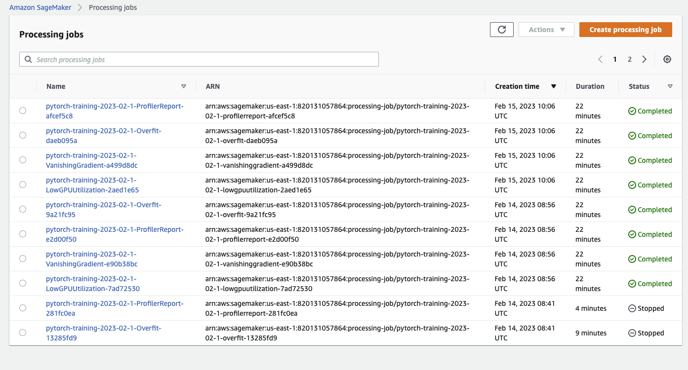

# Image Classification using AWS SageMaker

Use AWS Sagemaker to train a pretrained model that can perform image classification by using the Sagemaker profiling, debugger, hyperparameter tuning and other good ML engineering practices. This can be done on either the provided dog breed classication data set or one of your choice.

## Project Set Up and Installation
Enter AWS through the gateway in the course and open SageMaker Studio. 
Download the starter files.
Download/Make the dataset available. 

## Dataset
The provided dataset is the dogbreed classification dataset which can be found in the classroom.
The project is designed to be dataset independent so if there is a dataset that is more interesting or relevant to your work, you are welcome to use it to complete the project.

### Access
Upload the data to an S3 bucket through the AWS Gateway so that SageMaker has access to the data. 

## Hyperparameter Tuning
The model used in this project was ResNet18, the hyperparameters used were batch_size, epochs and learning rate(lr) the results are the following 
```
Accuracy: 79.76047904191617%, Testing Loss: 0.775725744013301
```
Remember that your README should:
- Include a screenshot of completed training jobs
- Logs metrics during the training process
- Tune at least two hyperparameters
- Retrieve the best best hyperparameters from all your training jobs

 
 
 ## Hyper parameter tuning
 
 
 ## Training jobs
 
 
 ## Training metrics
 
 
 
 
  
## Debugging and Profiling
In order to debug the train_model was used, and the rules were as follows
```
    ProfilerRule.sagemaker(rule_configs.LowGPUUtilization()),
    ProfilerRule.sagemaker(rule_configs.ProfilerReport()),
    Rule.sagemaker(rule_configs.vanishing_gradient()),
    Rule.sagemaker(rule_configs.overfit()),
```
### Results
The results of the debugging and profiling 
``` 
2023-02-15 10:28:08 Uploading - Uploading generated training model
2023-02-15 10:28:08 Completed - Training job completed
VanishingGradient: InProgress
Overfit: NoIssuesFound
LowGPUUtilization: InProgress
ProfilerReport: NoIssuesFound
Training seconds: 1242
Billable seconds: 1242
```

## Model Deployment
The deployment of the model was done using python script deply.py
#####  Endpoint in service
 

## Standout Suggestions
**TODO (Optional):** This is where you can provide information about any standout suggestions that you have attempted.
